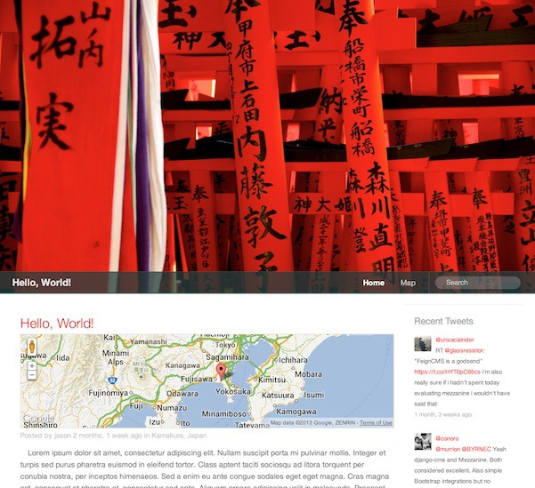
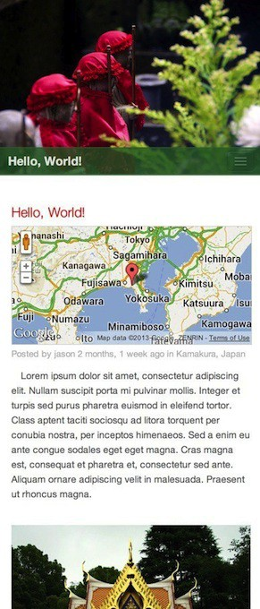
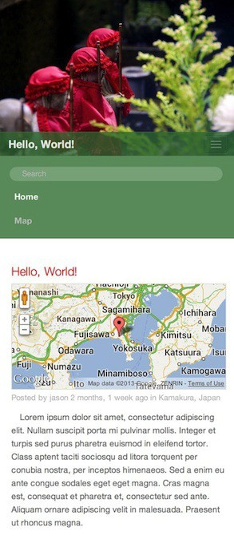

# Roca #

  
## Overview
-----------
Roca is an addon to [Mezzanine](https://github.com/stephenmcd/mezzanine), a
Django based content management system.  Some of the key features of Roca are:

* Minimalistic design with a focus on photography and images
* Location data can be added to blog posts
* Bootstrap responsive for optimal viewing amongst various devices

## Installation
----------------

Download the source package and place it in your Mezzanine project folder:

    __init__.py
    deploy/
    requirements/
    roca/
    fabfile.py
    local_settings.py
    manage.py
    settings.py
    urls.py
    wsgi.py

Add the `roca.core` app into the `INSTALLED_APPS` list in `settings.py`.  Ensure
that it is added above any **Mezzanine** installed apps:

	INSTALLED_APPS =(
		...
    	"django.contrib.sitemaps",
    	"django.contrib.staticfiles",
    	"roca.core",  #<-- Insert here
    	"mezzanine.boot",
    	"mezzanine.conf",
    	...

To use the enahnced blog app with support for location data add `roca.blog`
to `INSTALLED_APPS` **in addition** to commenting out the default
`mezzanine.blog` entry.  Failure to do so will result in conflict issues:

	INSTALLED_APPS =(
		...
    	"django.contrib.sitemaps",
    	"django.contrib.staticfiles",
    	"roca.core",
    	"roca.blog", #<-- Insert here
    	"mezzanine.boot",
    	"mezzanine.conf",    	
    	...
    	#"mezzanine.blog", #<-- Comment out
    	...

Once your `settings.py` file has been properly configured run `syncdb` to
update the database or use South to migrate the newly installed apps. 

## Configuration
----------------

Roca implements a *pseudo-random* design element through the top header photo
and navigation bar. By adding more **Photo Headers**, Roca will automatically 
select one at random on each page visit for a dynamic look and feel.  In 
addition to this the navigation bar is colorized at random. Both of these can
be configured through the `Admin` page.

## Screenshots
--------------

[Click here](http://blog.jtwong.com) for a live sample of Roca in action.

*Responsive layout creates a collapsable menu bar when viewed on smaller
devices.*

 
   

## Dependancies
---------------

**Python**

* Django (1.5.1)
* Fabric (1.6.0)
* Mezzanine (1.4.7)
* Pillow (2.0.0)
* South (0.7.6)
* bleach (1.2.2)
* django-geoposition (0.1.4)
* filebrowser-safe (0.2.27)
* grappelli-safe (0.2.21)
* html5lib (0.95)
* paramiko (1.10.0)
* psycopg2 (2.5)
* pycrypto (2.6)
* pygeocoder (1.1.4)
* pytz (2013b)
* wsgiref (0.1.2)

**Javascript**

* Justified Gallery
* Bootstrap
* JQuery

**Ruby**

* SASS
* Compass

